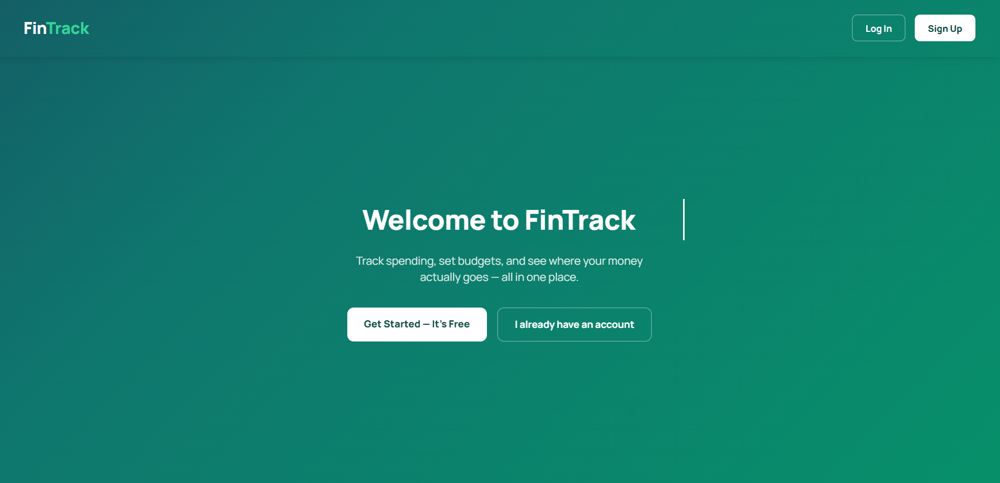
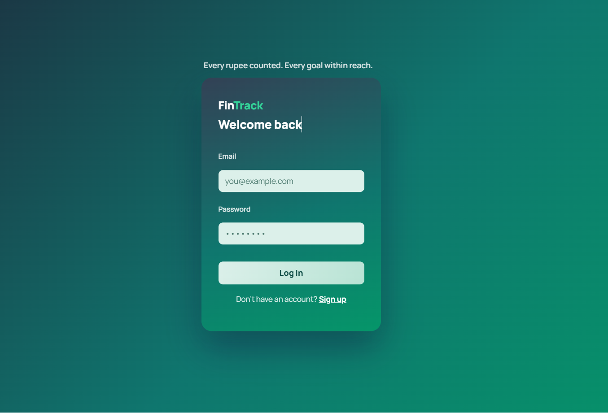
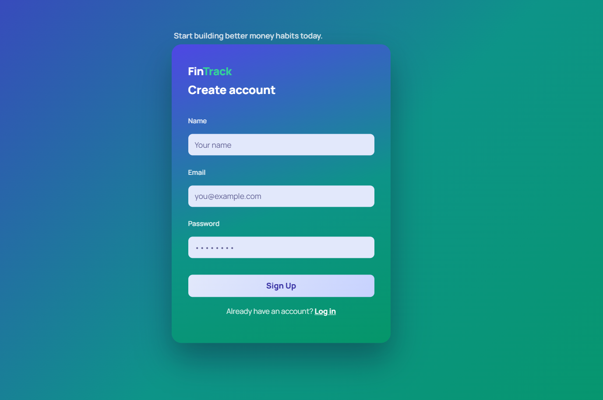
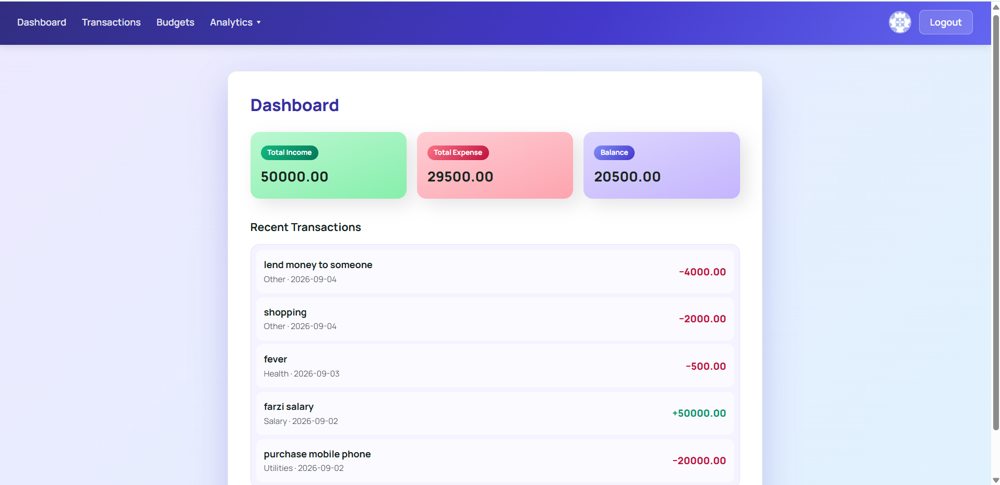
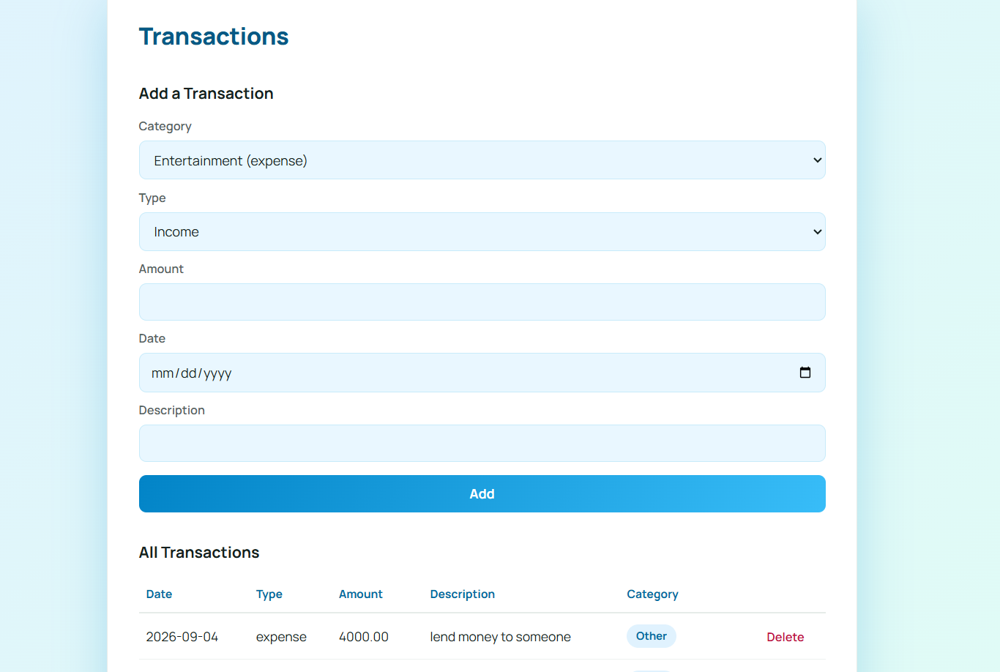
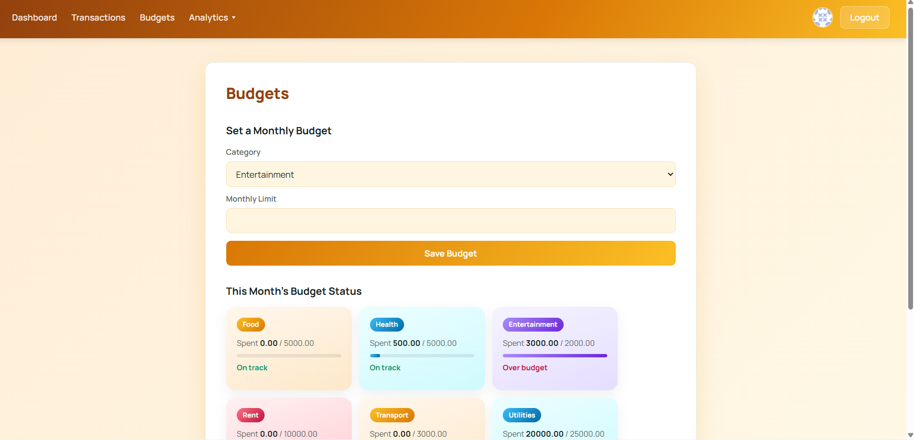
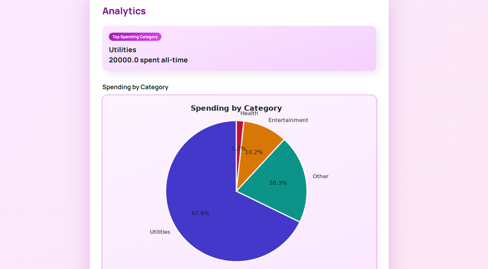
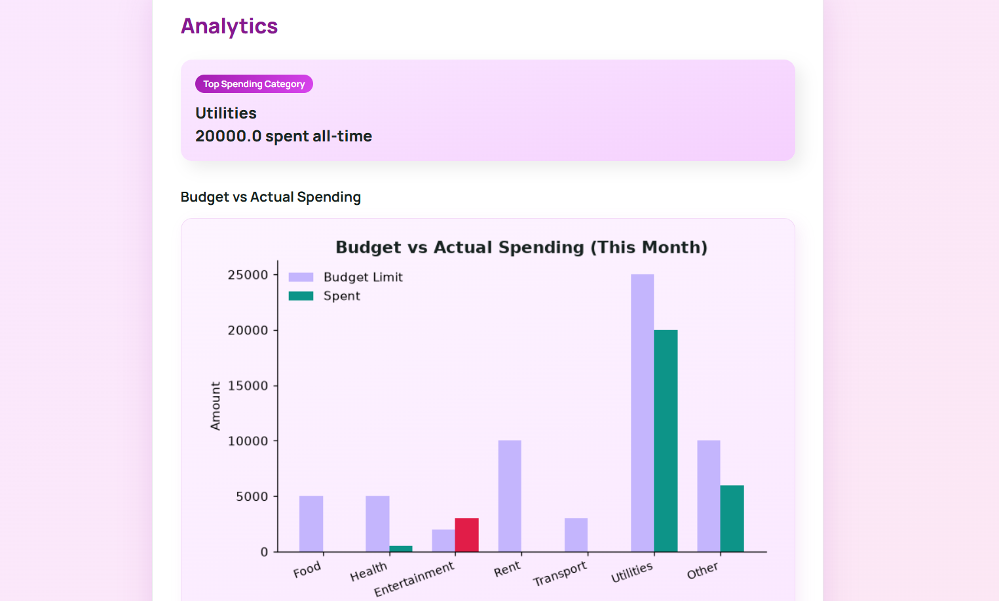

# FinTrack — Personal Finance Tracker

A full-stack personal finance tracker built with **Python, Flask, and MySQL**, featuring secure authentication, budget tracking, and data analytics powered by **pandas** and **matplotlib**.

## Features

- **Secure Authentication** — signup/login with bcrypt password hashing, session-based access control
- **Transaction Management** — full CRUD for income and expense entries, filterable by category, type, and date
- **Budgeting** — set monthly limits per category, with live spent-vs-remaining tracking and over-budget alerts
- **Analytics Dashboard** — pandas-powered aggregation with three matplotlib visualizations:
  - Spending breakdown by category (pie chart)
  - Income vs. expense trend over the last 6 months (bar chart)
  - Budget vs. actual spending comparison (bar chart)
- **Custom UI** — each page (Login, Signup, Dashboard, Transactions, Budgets, Analytics) has its own distinct color theme and animations, built with hand-written CSS (no frameworks)
- **Profile Avatar** — Gravatar-based user avatar in the navigation bar

## Tech Stack

| Layer | Technology |
|---|---|
| Backend | Python, Flask |
| Database | MySQL |
| Data Analysis | pandas |
| Visualization | matplotlib |
| Auth | bcrypt (password hashing) |
| Frontend | HTML, CSS (Jinja2 templating) |

## Project Structure

finance_tracker/
├── app.py # Flask routes and app entry point
├── db.py # MySQL connection handling
├── config.py # Environment variable loading
├── analytics.py # pandas + matplotlib chart generation
├── schema.sql # Database schema
├── models/
│ ├── user_model.py # Signup, login, password hashing
│ ├── transaction_model.py # Transaction CRUD
│ ├── category_model.py # Category management
│ └── budget_model.py # Budget tracking logic
├── templates/ # Jinja2 HTML templates
├── static/
│ ├── css/style.css # All styling
│ └── js/
└── requirements.txt


## Setup Instructions

### 1. Clone the repository
```bash
git clone https://github.com/MdEzazullah/finance-tracker-with-analytics.git
cd finance-tracker-with-analytics
```

### 2. Create a virtual environment
```bash
python -m venv venv
venv\Scripts\activate        # Windows
source venv/bin/activate     # Mac/Linux
```

### 3. Install dependencies
```bash
pip install -r requirements.txt
```

### 4. Set up the database
Create a MySQL database and run the schema:
```bash
mysql -u root -p < schema.sql
```

### 5. Configure environment variables

Copy `.env.example` to `.env` and fill in your own values:
DB_HOST=localhost
DB_USER=root
DB_PASSWORD=your_mysql_password
DB_NAME=finance_tracker
SECRET_KEY=your_random_secret_key


### 6. Run the app
```bash
python app.py
```
Visit `http://127.0.0.1:5000` in your browser.

## Database Schema

Four core tables with foreign key relationships:
- `users` — id, name, email, password_hash
- `categories` — id, name, type (income/expense)
- `transactions` — id, user_id, category_id, amount, type, date, description
- `budgets` — id, user_id, category_id, monthly_limit

## Screenshots

*(Add screenshots of your Dashboard, Analytics, and Budgets pages here before publishing — they make a big difference for anyone browsing your repo.)*

## What I Learned

- Structuring a Flask app with separated concerns (models, routes, templates)
- Preventing SQL injection with parameterized queries
- Secure password storage with bcrypt
- Using pandas `groupby` and `pivot_table` for financial data aggregation
- Generating matplotlib charts server-side and embedding them as base64-encoded images
- Building a multi-theme CSS design system driven by Flask template inheritance

## License

This project is open source and available for anyone to learn from or build upon.

### Landing Page


### Login


### Sign Up


### Dashboard


### Transactions


### Budgets


### Analytics


### Analytics
